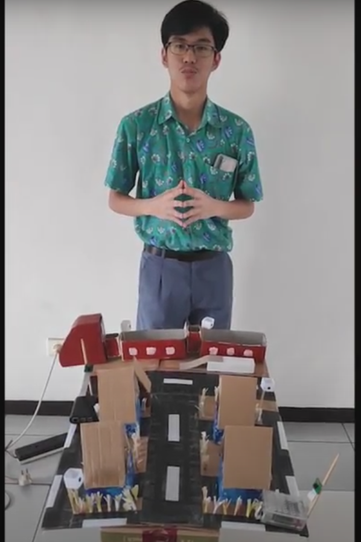
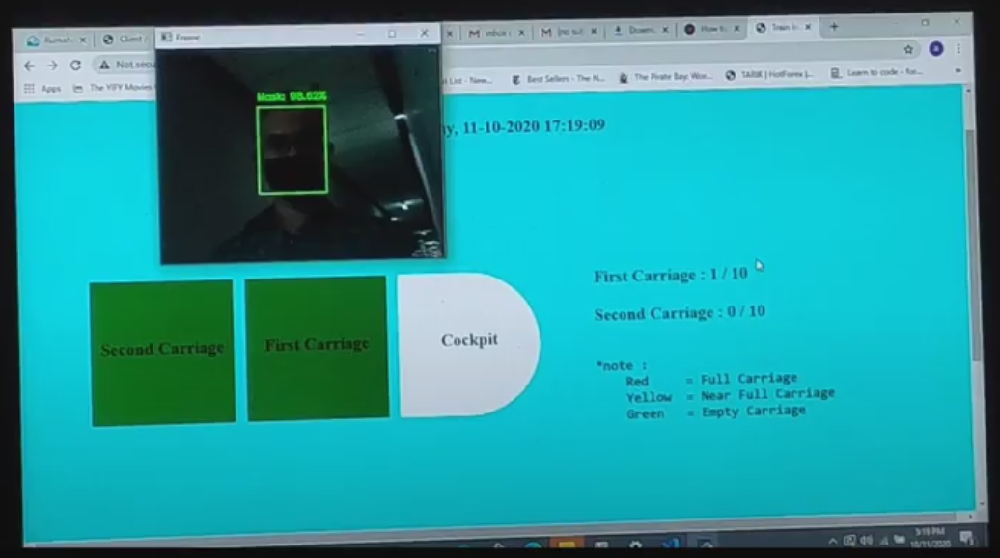
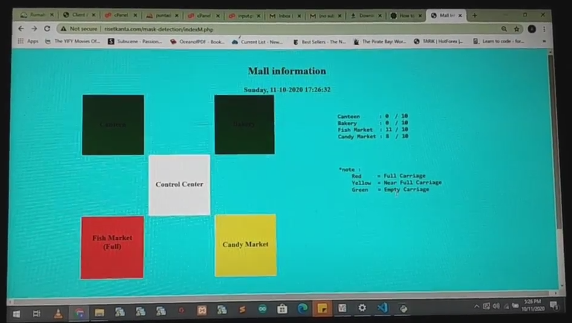
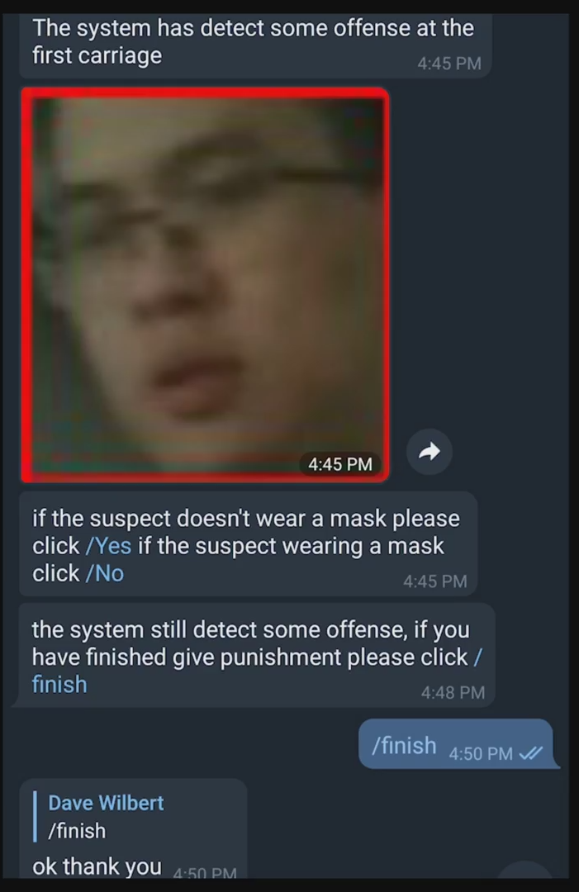

# Smart City Health Protocol System 

This project helps environtment developer to control some place in one area, this system detecting the violation of not wearing a mask, and count the capacity person in one place, this system also can make a report to nearby officer by Telegram Bot to make further action.

---

### Table of Contents

- [Description](#description)
- [Documentation](#documentation)
- [Author Info](#author-info)

---

## Description

This Project 2 Raspberry Pi sets that include camera and speakers, the Raspberry Pi camera sending picture to the main computer to make mask detection using deep learning, and also detecting number of person in one place, the data that have been collected it will be stored in database, the raspberry also can acces the databases to make action like warning, the data in the databases also can beshown in the website that can be show in the monitor.
These are some example of the monitoring UI :
Train UI Example :

Mall UI Example :

Report example:

#### Technologies

- Deep Learning
- Mysql Databases
- Raspberry Pi
- RTSP Protocol

[Back To The Top](#smart-city-health-protocol-system)

---

## Documentation

[Demo Video](https://drive.google.com/file/d/1UY5U6le68_mG-VUBjzdg2TOh8kRE_WxV/view?usp=sharing)

This project got the runner-up position in [WIT2020: The 7th World Innovative Technology Challenge 2020](https://ausrobotics.org/events/wit2020/)

[Back To The Top](#smart-city-health-protocol-system)

---
## Author Info

- instagram - [daffeydwilbert](https://www.instagram.com/daffeydwilbert/)
- Email - daffeydwilbert@gmail.com

[Back To The Top](#smart-city-health-protocol-system)

